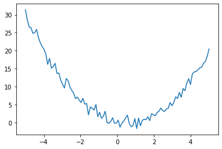
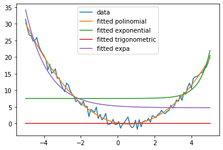
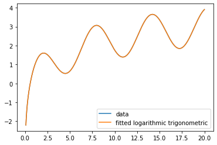

# Elemental Function Fitter

Elemental Function Fitter is a program designed to infer the type of functions and fit given a file of $x,f(x)$ data.
## Description
#
Elemental Function Fitter is able to fit a curve to either one elementary or a lineal combination of two elementary functions. It uses the least squares method and, in a linear combination, first using a Differential Evolution algorithm to optimize initial parameters necessary for the least squares method

### Current Supported Functions:
- polinomials (pol)
- exponentials (expo for e, expa for general)
- logarithms (log)
- trigonometric functions (trig)
- powers of x (pow)
## Algorithm
#
For an optimization problem, as the fitting of a curve is, there are various ways to optimize this result, as a gradient or linealicing the model.

As we are working on a general function fitter, we have to take into account that in most cases a linealization will not be possible. So we will be focusing on the other alternative.

First, our functions will be written as $y = f_c(x) = F(x,c_1,...c_n)$

We'll be working to minimize the error function:

$E(c1,...c_n) = \sum_{k=1}^{m}[y_k - F(x_k,c_1,....c_n)]$

We can consider that the error function has a lower bound, if F is countious in respect of the parameters, there is a minimum. And if F is derivable, then the minimums will be reached on the values of C where $\nabla E= 0 $

So the least squares method consists of minimizing the sum of this error squared, so as:

$S = \sum_{i = 1}^{n} (y_i - f(x_i))^2$

For this optimization, we'll employ the use of scipy's optimize.curve_fit, which will minimize this sum.

However, for more complex functions, the initial parameters for the coefficients needed by the Gram Matrix need to be computed before, as the stability of a numerical least squares is not assuder for every p0 initial coefficients.

For that reason, we'll be using the help of differential evolution (scipy) which will, by a genetic algorithm. Where we'll try to optimize the sum of squared error. It optimizes each candidate solution by mixing with other candidates solution and assesses its fitness, replacing the best candidate in case it is better.

 This algorithm should converge into useful paramethers, however, in case the parameters found don't work afterwards in the least_squares method, the algorithm will be repeated with a different seed, as the possible values of p0 can differ wildly both in magnitude and sign.

Afterwards the data is compared to different parameters, maximum relative error, minimum deviation to ensure that the fit aproximates the curve correctly.

In case all is approved, the fit will be compared with other fits by its magnitude of covariance of paramethers (errmd). Which is computed calculating the diagionals of the covariance matrix of the fit, then calculating it's module to have only one number to compare between fits independent of the number of parameters of the function.

We assume that as the covariance matrix shows wether the parameters of a functions are independent (lower value) or related between them (higher value), we can compare between two "good" fits of the curve, as one fucntion will be less correlated, which means should be a better function to generate the data (thus finding the "generator" function.)

Also, this approach works best for comparing between polinomial fits, as you can always overfit a function with another coefficient. For example $x + x^2$ can be overfitted as $x+ x^2 + x^3+ C$ without worsening fit in a bounded data. For that, this algorithm works twice, first checking whether there are near 0 coefficients (mincoeff) which would mean overfitted data, and with errmd, as the first function shown would have a covariance as an example of (1e-5,1,2e-5) compared to the overfitted of (1e-5,1.2e-5,1e-10,...), where doing the module will create an $errmd_1 < errmd_2$, thus giving a worse value to overfitted data, prefering less coefficients over more where the fit is the "same". Most important when allowing higher order of polinomials as those can resemble a Taylor series of any elementary function.

## Usage
#
### Data Creator
There is a data creator included (datacreator.py) which is able to, given the commands given by the user, generate this curve in an x-y plane and save it to a csv file, with a header giving the functions of the data and the coefficients necessary for its generation

Also, given is also a tool to generates two types of noise in the data:

- Random noise from the environment, where given a value for a std deviation it will add a random normal noise with that standard deviation

 
- Error in the measure, where it is simulating a well calibrated measurement device like an osciloscope, where the error is a relative value of the measurement (ex. 1%), instead of an absolute value like noise.

 


### Fitter
Main file, asks the user for the data file, the functions to try the fitting with and wether to fit with one or two functions. Also asks for the necessary parameters to fit, such as the maximum error allowed, maximum order of the polinomia (for lineal combinations it is best to try first with maxorder < 5 due to the many computations necessary), the minimal standard deviation, etc. (best explained in functions and the algorithm)

Then calls for functions.py to do the fitting and prints the results.

- When not asked for full output:

It will print out in console the probable function type or lineal combination of functions, such as polinomial, exponential; polinomial logarithmic.

The coefficients neccesary for calculating the fit.
If it is for a lineal combination it will also return both the function wrapper created for the winning lineal combination $f(x,*args))$ for easier access both of plotting and for generalization; and the correlation between parameters, as for some cases the winning will not be the correct generator function: as a rule of thumb, if the correlation is less than 1 it will probably be either not a good fit, the data has not enough information, or the generator function is not between the candidate functions.

Also plots both the data and the fit for visual purposes.

-Full output:

All of the above plus prints out all coeffs, exit codes (see functions) and its correlations.

 

```
We found that it is most likely that the function is a polinomial
the coeffs are [ 0.19158687 -1.08455335  0.95508563  0.00156655  0.00137004]
Total time for fitting 0.0244 seconds
```

```
We found that it is most likely that the function is a logarithmic trigonometric
the coeffs are [ 1.00000000e+00 -1.00000000e+00 -1.00000000e+00  8.88178439e-15]
the correlation between variables is 2.0285192586863e-16
Total time for fitting 68.5834 seconds
```
## Modules
### Mathfunctions
File where all mathematical functions are defined i.e the exponential function, trigonometric (sine) function, etc. They all have two versions, one optimized for 1 function fitting, and a second "lc" one optimized for lineal combinations, without a constant variable, wich will be added as an extra. As an example a lineal combination  would be written as.

$ asin(x) + blog (x) \rightarrow sinlc(x,*args) + loglc(x,*args) + cnst(x,c)$

### Functions
Module where all necessary functions for correct fitting, data generation and file work is located. It has different types of fucntions:
- Givetofunc: Getting x data, will return f(x) chosen the function and the coefficients, giving error when not correct
- read/write csv Reads and writes an csv file (see datacreator)
- add measure/noise error: returns matrix of errors asked from datacreator.
- "..."fit fitter functions: which will execute the algorithm up to and not including errmd. There is one for each elementary function and ffit, which is a more general function for lineal combination fitting.
- comparefits: called from Fitter, will call each "..."fit from the list of functions given, computes errmd from the algorithm and chooses the best fit out of all. As this is only for fit of one function it will not use the genetic algorithm
- comparelimcombfits: called from Fitter, will call each ffit for each possible 2-fold combination from the list of functions given, computes errmd from the algorithm and chooses the best fit out of all. It uses the genetic algorithm.

## Known Issues
- For curves where the behaviour of an elementary function cannot be seen in the data bounds, it will either not produce a good fit or it won't fit. Such as a polinomial and a sin where the curve is around 0 for 75% of the data and for the other data  goes to  really high values.
- Sometimes for harder curves the 1 function fit will not produce a satisfactory fit, this is due either to a low order polynomial or the fit needs to be generated with a genetic function, not done because as it it is rare fenomenom it isn't worth the huge loss of speed. As a workaround fit 2 fun with pol, fun with maximum order 1 or 0.

- The coefficients calculated might differ wildly from the coefficients used to generate the data. As the curve is not infinite, the fit will only interpolate for the known data, which can create a "perfect" fit for the bounds of values (x,y) given but not for $(-\infty,\infty)$. For that, higher amounts of data are needed and higher bounds, getting the best fit at $(-\infty,\infty)$.

- Rarely the fitter wil return the right lineal combination but the function will be mixed with another, to fix it just run the script again only with the winning pair of functions
